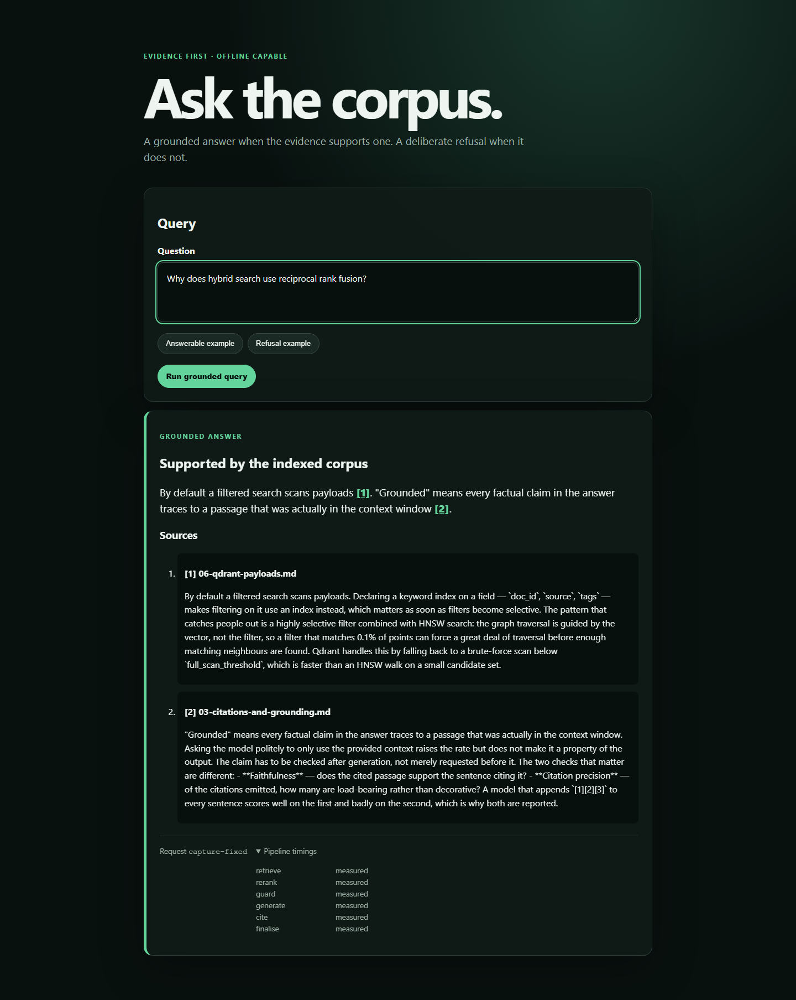
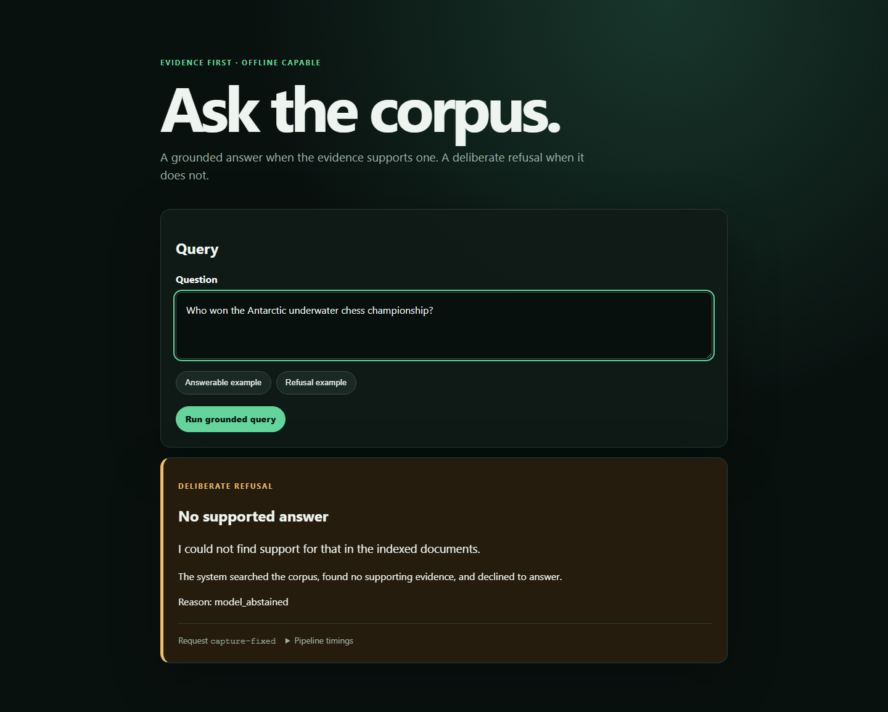
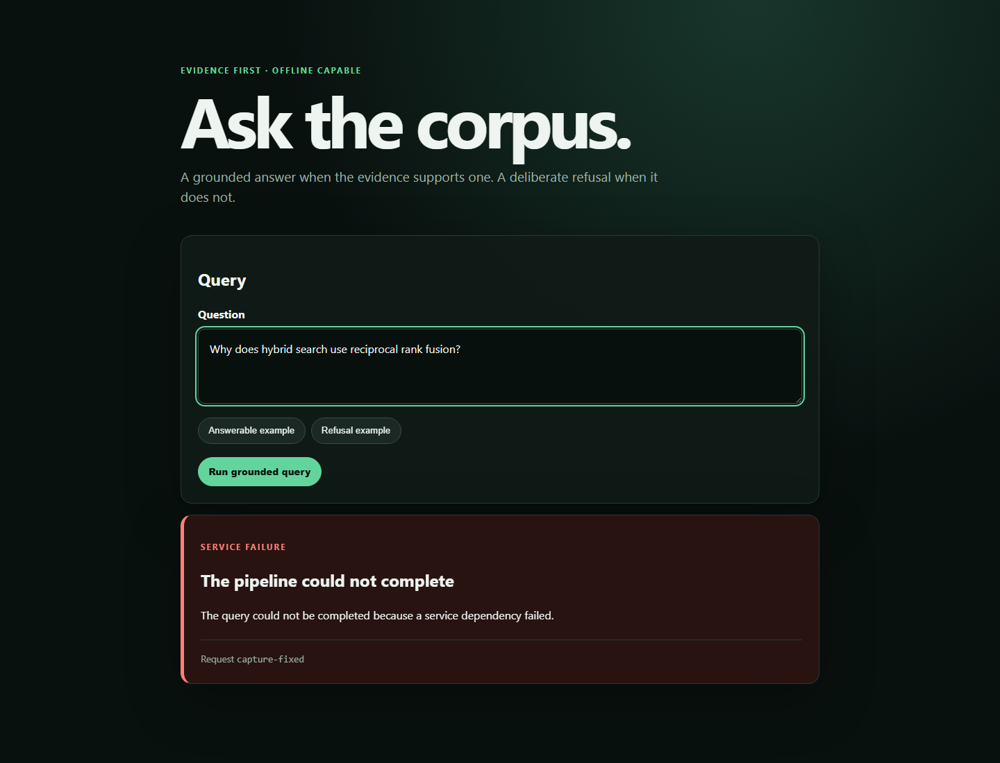
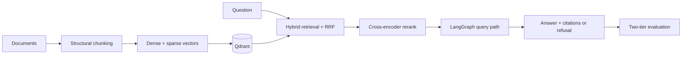

# production-rag

A production-shaped Retrieval-Augmented Generation service with hybrid Qdrant retrieval, reranking, grounded answers, and reproducible offline evaluation.

[](https://github.com/pabloalvarez99/production-rag/actions/workflows/ci.yml)
[](LICENSE)
[](https://www.python.org/downloads/)

## Demo

These are generated from the real Compose stack with the deterministic fake providers and
sample corpus—not hand-taken screenshots. The grounded capture exposes its sources and node
timings; the other two show the explicit refusal and dependency-failure contracts.







Regenerate them with `pip install -e ".[docs]"`, `playwright install chromium`, then
`python scripts/capture_ui.py`. The script fixes the viewport, questions, collection, fake
providers, request-id label, and timing labels so identical app/browser inputs produce
byte-identical PNGs; it prints each SHA-256 digest for a second-run comparison. The outcome,
answer, citations, refusal reason, and service failure are all produced by the live stack.

## Scorecard

<!-- SCORECARD:START -->
<!-- Generated by tools/render_docs.py. Source: docs/_scorecard.md.in. -->
The committed scorecard below is a deterministic contract fixture. It proves that the
measurement artefact can reach the public documentation without copy-and-paste; it says
nothing about retrieval or answer quality.

| Configuration | `hit_at_5` |
| --- | --- |
| Sparse | **0.560**<br><sub>⚠️ **FAKE PROVIDERS — plumbing check only, not a quality claim.** embedder=fake; LLM=fake; judge=none; n=60; date=2026-08-11; commit=04102b0dcf8d</sub> |
| Dense | **0.060**<br><sub>⚠️ **FAKE PROVIDERS — plumbing check only, not a quality claim.** embedder=fake; LLM=fake; judge=none; n=60; date=2026-08-11; commit=04102b0dcf8d</sub> |
| Hybrid | **0.500**<br><sub>⚠️ **FAKE PROVIDERS — plumbing check only, not a quality claim.** embedder=fake; LLM=fake; judge=none; n=60; date=2026-08-11; commit=04102b0dcf8d</sub> |
| Hybrid + rerank | **0.500**<br><sub>⚠️ **FAKE PROVIDERS — plumbing check only, not a quality claim.** embedder=fake; LLM=fake; judge=none; n=60; date=2026-08-11; commit=04102b0dcf8d</sub> |

Comparison: **Directional only:** hybrid - sparse = -0.050 (95% CI -0.133 to +0.017; n=60); **not reportable** — ci95 includes zero.<br><sub>⚠️ **FAKE PROVIDERS — plumbing check only, not a quality claim.** embedder=fake; LLM=fake; judge=none; n=60; date=2026-08-11; commit=04102b0dcf8d</sub>

Bootstrap reproducibility: seed `**20260811**<br><sub>⚠️ **FAKE PROVIDERS — plumbing check only, not a quality claim.** embedder=fake; LLM=fake; judge=none; n=60; date=2026-08-11; commit=04102b0dcf8d</sub>`,
`**10000**<br><sub>⚠️ **FAKE PROVIDERS — plumbing check only, not a quality claim.** embedder=fake; LLM=fake; judge=none; n=60; date=2026-08-11; commit=04102b0dcf8d</sub>` paired resamples.

The next measurement action is to run the same scorecard contract with named real
providers and replace the fixture artefact; until that artefact exists, this table remains
an explicitly labelled plumbing check.

### Reporting rule

Here, **reportable** means the paired comparison has enough evidence to support a
directional claim under the recorded interval and test. A result that is not reportable is
still useful diagnostic evidence, but the renderer prints it as “directional only,” with
its sample size and interval, instead of turning its delta into a claim. A slice with 10
items is shown that way because one changed case moves the result substantially and the
slice is underpowered; showing the uncertainty is more informative than hiding the slice.
<!-- SCORECARD:END -->

## The problem

Most RAG demos are one embedding call, one cosine search and a prompt. They fail on the first real corpus: acronyms and part numbers that dense embeddings cannot see, top-k results that are similar but not relevant, answers no one can trace to a source, and no way to tell whether a prompt change made the system better or worse.

This service separates those failure modes:

| Concern | Position taken here |
| --- | --- |
| Retrieval | Dense and sparse/BM25 retrieval run together in Qdrant and are fused with reciprocal rank fusion (RRF). |
| Precision | A cross-encoder reranker reorders fused candidates before generation. |
| Trust | The answer contract carries citations to the chunks used as evidence and can refuse when evidence is absent. |
| Change safety | Two offline evaluation tiers separate retrieval metrics from answer and citation metrics. |
| Operability | Environment-based configuration, structured logs, request correlation, health probes, and optional tracing seams. |

## Architecture



Four decisions define the system:

| Decision | Consequence | Record |
| --- | --- | --- |
| Hybrid retrieval lives in Qdrant | Exact tokens and semantic matches remain separate until RRF combines their ranks. | [ADR-0001](docs/adr/0001-hybrid-qdrant.md) |
| LangGraph owns query orchestration | Retrieval, rerank, evidence checks, generation, and citation resolution are explicit nodes with inspectable state. | [ADR-0002](docs/adr/0002-langgraph-query.md) |
| Evaluation has two tiers | Free retrieval checks run separately from sampled answer judging; provenance travels with every result. | [ADR-0003](docs/adr/0003-eval-strategy.md) |
| Grounding is a response contract | Citation markers resolve to structured source records; insufficient evidence produces a refusal instead of invented support. | [ADR-0005](docs/adr/0005-grounded-generation.md) |

See [architecture](docs/architecture.md) for the component and failure-path detail.

## Run it offline, $0, no credentials

Requires Python 3.12+. The first runnable path uses deterministic local fakes, makes no billed provider calls, and needs no credential.

<!-- provenance-allow: historical-measurement: measured Windows cold start from a clean checkout, retained with its environment -->
A clean Windows cold start was measured at 4.8 minutes, including dependency installation, image startup, ingest, and the first query. Warm starts are shorter; this is the reviewer-facing clone-to-answer measurement.

```bash
python -m venv .venv
source .venv/bin/activate        # Windows PowerShell: .venv\Scripts\Activate.ps1
python -m pip install -e ".[dev]"
python -m pytest -q
```

Start the API locally:

```bash
python -m uvicorn production_rag.main:app --port 8000
curl -s http://localhost:8000/health
```

The complete offline evaluation path uses local Qdrant through Compose:

```bash
docker compose up -d --build
docker compose run --rm api python -m production_rag.ingest --source data/raw --embedder fake --recreate-collection
docker compose run --rm api python -m production_rag.evals.run --tier all --embedder fake --llm fake
```

`make reingest-fake` and `make eval-all-fake` are optional shortcuts for those
two commands. Windows users do not need to install `make`.

Those results validate data flow and contracts, not retrieval or answer quality. See the [runbook](docs/runbook.md) for Docker and operational commands.

## Status by capability

| Capability | State | Evidence or boundary |
| --- | --- | --- |
| Structural ingest with stable, citable chunk payloads | **LIVE** | `production_rag.ingest`; fake and optional hosted embedding paths |
| Dense + sparse retrieval with RRF | **LIVE** | `production_rag.retrieve`; Qdrant-backed query path |
| Cross-encoder reranking and fail-open fallback | **LIVE** | Local, optional Cohere, and deterministic fake adapters |
| Grounded generation with citations and refusal | **LIVE** | LangGraph-backed `POST /v1/query` and CLI |
| Health, readiness, request IDs, structured logs | **LIVE** | `/health`, `/v1/ready`, middleware and safe diagnostics |
| Optional tracing seam | **LIVE** | Null tracer by default; Langfuse is opt-in |
| Two-tier evaluation and explicit retrieval gate flag | **LIVE** | `production_rag.evals.run`; `--fail-under-hit` defaults to reporting only |
| Metrics export endpoint | **DECLARED** | Config shape exists; no `/metrics` route |
| Auth, rate limits, production retry policy | **OUT** | Hardening is planned, not represented as live |
| User interface | **OUT** | API and CLI only |
| Provider-backed quality scorecard | **OUT** | Wave 8; no real-provider baseline has been measured |

## How it is measured

The harness deliberately separates two questions:

| Tier | Measures | Default path |
| --- | --- | --- |
| Tier 1: retrieval | Source-level `source_hit@k`, `source_recall@k`, MRR, and binary-gain nDCG | Fake embedder; deterministic plumbing check |
| Tier 2: answer | Judge-free citation precision, invalid-marker rate, refusal accuracy; optional judged faithfulness and relevance | Fake LLM and fake judge; deterministic contract check |

The only implemented gate is `--fail-under-hit` on tier-1 source hit, and its default is `0.0`: reporting only. No merge threshold is armed until a real-provider baseline and a larger labelled set justify one.

Reproduce the free path:

```bash
make eval-tier1
make eval-tier2-fake
make eval-all-fake
```

Or invoke the runner directly:

```bash
python -m production_rag.evals.run --tier all --embedder fake --llm fake --report data/eval/reports/all-fake.json
```

A report records the invocation and provider identity. Any externally quoted number must repeat its embedder, LLM, judge, `n`, and date. The detailed interpretation rules are in [evaluation](docs/evaluation.md).

## Engineering process: how it was built

The repository was built milestone by milestone by an orchestrated engineering fleet. The portfolio evidence is the ownership and integration discipline: commits and ADRs make each decision and handoff reviewable.

| Seat | Ownership | Integration responsibility |
| --- | --- | --- |
| A1 — core | Package implementation and unit contracts | Land core modules first and leave a clean tree |
| A2 — surface | README, architecture/evaluation docs, ADR reconciliation, CI | Describe only code present at the integrated tip |
| A3 — glue | API/CLI/Make/PowerShell adapters and integration tests | Wire existing core modules without duplicating them |

The anti-collision protocol is explicit:

1. Each wave assigns files to one seat; another seat does not “help” across that boundary.
2. The merge order is **A1 → A2 → A3**, with a clean tree at every handoff.
3. Each seat verifies the integrated tip, not an uncommitted workspace shared with another seat.
4. Final verification runs from a clean clone so untracked modules cannot make local glue appear valid.

That last rule came from a real integration failure: a glue commit added Make targets for a module that existed in a worker's directory but had not entered git. The local workspace passed; the commit did not. The corrective rule is dependency-ordered landing plus clean-clone verification. This is a build-control lesson, not a claim that autonomous authorship replaces review.

Commit prefixes such as `feat(m4-a1)` and `feat(m5-a3)` preserve the wave and seat that owned each change. ADRs preserve the non-obvious trade-offs separately from implementation commits.

## Roadmap and non-goals

| Next | Outcome |
| --- | --- |
| Wave 8 scorecard | Run retrieval and answer evaluation with named real providers, a calibrated judge, stated `n`, and a dated report |
| Hardening | Add auth and rate limits, define retries/timeouts, and expose production metrics |
| Portfolio demo | Record the honest end-to-end GIF and publish the architecture/scorecard artifacts |
| UI, if justified | Add a client only after the API behaviour and measurements are stable |

The complete M0–M6 implementation narrative is preserved in [milestones](docs/milestones.md).

Explicit non-goals for the current release:

- No claim that fake-provider scores measure semantic quality.
- No multi-tenant authorization or public-internet hardening.
- No UI.
- No replacement for source review: citations provide provenance, not automatic truth.
- No framework abstraction that hides the ingest, retrieval, or evaluation contracts.

## License

[MIT](LICENSE) © 2026 Pablo Figueroa.
