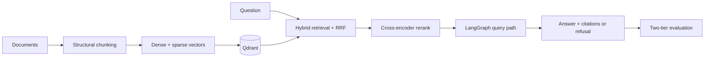

# production-rag

<p align="center">
  <a href="https://github.com/pabloalvarez99/production-rag"></a>
  <a href="https://github.com/pabloalvarez99/agentic-rag-research"></a>
  <a href="https://github.com/pabloalvarez99/multi-agent-orchestration"></a>
  <a href="https://github.com/pabloalvarez99/repomind"></a>
  <a href="https://github.com/pabloalvarez99/ai-platform"></a>
</p>

A production-shaped RAG service: hybrid retrieval in Qdrant, cross-encoder reranking,
answers that cite the exact chunks they used, an explicit refusal when the evidence is
absent, and a two-tier offline evaluation harness with paired statistics.

**The entire path — ingest, retrieval, answer, web UI, evaluation — runs on deterministic
local providers.** No credential, no billed call, no signup. Clone it and get a cited
answer in one command.

Why it exists: most RAG demos are one embedding call, one cosine search and a prompt, and
they hide the four failure modes that decide whether a system survives a real corpus —
acronyms and part numbers dense vectors cannot see, top-k results that are similar but not
relevant, answers nobody can trace to a source, and no way to tell whether a change helped.
Each one has a stated position here, an ADR, and a test.

[](https://github.com/pabloalvarez99/production-rag/actions/workflows/ci.yml)
[](LICENSE)
[](https://www.python.org/downloads/)

**Ship status: [v0.1.0](https://github.com/pabloalvarez99/production-rag/releases/tag/v0.1.0)
is published with a public-ready free path.** Clone, run, and review everything below without a
credential; the one open item is a hosted-provider baseline run. One page with the demo, what
CI proves, and what is deliberately absent: [docs/SHIP.md](docs/SHIP.md). The engineering
story behind the trade-offs, with the failure behaviour and the honest limits:
[docs/CASESTUDY.md](docs/CASESTUDY.md). How to run the checks
and contribute: [CONTRIBUTING.md](CONTRIBUTING.md). How to report a vulnerability, and why no
key belongs in an issue: [SECURITY.md](SECURITY.md). Release history: [CHANGELOG.md](CHANGELOG.md).

## Try it free ($0, no API key)

Every command in this section runs on deterministic local providers: no credential, no
provider network call, no spend. Requires Docker and Python 3.12+.

<!-- provenance-allow: historical-measurement: measured Windows cold start from a clean checkout, retained with its environment -->
A clean Windows cold start was measured at 4.8 minutes, including dependency installation,
image startup, ingest, and the first query. That is the reviewer-facing clone-to-answer
number; warm starts are shorter.

### 1. The demo stack and the UI, one command

```powershell
.\scripts\demo_setup.ps1          # macOS or Linux: ./scripts/demo_setup.sh
```

It starts Qdrant, rebuilds the `prag_demo` collection from `data/corpus` with the
deterministic embedder, and serves the UI at <http://localhost:8000/>. Ask both questions,
in this order:

1. *Why does hybrid search use reciprocal rank fusion?* — a grounded answer with clickable
   citation markers, the source passages behind them, and per-node timings.
2. *Who won the Antarctic underwater chess championship?* — an explicit refusal with its
   reason, which reads as a product decision only after the first answer proved the system
   will answer when it has evidence.


Those three captures are generated from the running stack, not hand-taken:
`pip install -e ".[docs]"`, `playwright install chromium`, then `python scripts/capture_ui.py`.
The script fixes the viewport, questions, collection, providers, request-id label and timing
labels, so identical app and browser inputs produce byte-identical PNGs, and it prints each
SHA-256 digest for a second-run comparison. A change to the templates or the stylesheet
refreshes these files in the same pull request, so a stale capture is provable rather than
arguable.

### 2. Ingest and query without the UI

```bash
docker compose up -d --build
docker compose run --rm api python -m production_rag.ingest --source data/raw --embedder fake --recreate-collection
curl -s http://localhost:8000/health
curl -s -X POST http://localhost:8000/v1/query -H 'content-type: application/json' \
  -d '{"question":"Why does hybrid search use reciprocal rank fusion?"}'
```

`POST /v1/query` defaults to the local providers, so the request above needs no credential.
The same pipeline is reachable from the CLI, with the safe timing breakdown:

```bash
docker compose run --rm api python -m production_rag.query \
  --question "Why does hybrid search use reciprocal rank fusion?" --embedder fake --llm fake --debug
```

### 3. Both evaluation tiers

```bash
docker compose run --rm api python -m production_rag.evals.run --tier all --embedder fake --llm fake
```

The last line of stdout is a versioned JSON report carrying the aggregates, the per-case
results, and the provider identity of the run. `make reingest-fake`, `make eval-tier1`,
`make eval-tier2-fake` and `make eval-all-fake` wrap the same commands and add the writable
report mount; Windows users do not need `make`.

### 4. The scorecard artefact, end to end

```bash
docker compose run --rm -v "$PWD/data/eval/reports:/app/data/eval/reports" api \
  python -m production_rag.evals.matrix --collection prag_matrix --ingest
python tools/render_docs.py            # rewrite the Scorecard region from the artefact
python tools/render_docs.py --check    # what CI runs: fail when the region is stale
```

This is the slowest free path: it sweeps four configurations over the 60-item adversarial
golden set and writes `data/eval/reports/scorecard.json`, the only source the published
table below is allowed to have.

These runs validate data flow, contracts and plumbing. They are not a quality measurement —
see [optional paid providers](#optional-paid-providers) for exactly what the local path does
and does not prove.

## What runs today

| Capability | State | Evidence or boundary |
| --- | --- | --- |
| Structural ingest with stable, citable chunk payloads | **LIVE** | `production_rag.ingest`; content-hashed chunk ids, bounded chunker |
| Dense + sparse retrieval fused with RRF | **LIVE** | `retrieval/hybrid.py`, `retrieval/rrf.py`; named sparse vectors in Qdrant |
| Cross-encoder reranking with fail-open degradation | **LIVE** | `retrieval/rerank.py`; local, optional Cohere, and deterministic adapters |
| Grounded generation with resolvable `[n]` citations | **LIVE** | `generation/citations.py` behind the LangGraph nodes in `graph/` |
| Refusal as a first-class response outcome | **LIVE** | `generation/guardrails.py`; insufficient evidence never invents support |
| Server-rendered query UI | **LIVE** | `api/routes/ui.py` and htmx; pins the local embedder and generator, so the UI cannot bill |
| Health, readiness, request ids, structured logs | **LIVE** | `/health`, `/v1/ready`, middleware, caller-controlled safe diagnostics |
| Tracing seam | **LIVE** | Null tracer by default; Langfuse is opt-in |
| Two-tier evaluation with paired statistics | **LIVE** | `evals/run.py`, `evals/matrix.py`, `evals/stats.py`; `--fail-under-hit` reports by default |
| Scorecard publication that fails closed | **LIVE** | `tools/render_docs.py` renders one artefact into this README; a stale region breaks CI |
| Metrics export endpoint | **DECLARED** | Config shape exists; no `/metrics` route |
| Provider-backed quality numbers | **OUT** | The published table is a local-provider plumbing fixture |
| Auth, rate limits, production retry policy | **OUT** | Platform scope (P5), not represented as live here |

## The problem it solves

| Concern | Position taken here |
| --- | --- |
| Retrieval | Dense and sparse/BM25 retrieval run together in Qdrant and are fused with reciprocal rank fusion (RRF). |
| Precision | A cross-encoder reranker reorders fused candidates before generation. |
| Trust | The answer contract carries citations to the chunks used as evidence and can refuse when evidence is absent. |
| Change safety | Two offline evaluation tiers separate retrieval metrics from answer and citation metrics. |
| Operability | Environment-based configuration, structured logs, request correlation, health probes, and optional tracing seams. |

## Architecture



Five decisions define the system:

| Decision | Consequence | Record |
| --- | --- | --- |
| Hybrid retrieval lives in Qdrant | Exact tokens and semantic matches remain separate until RRF combines their ranks. | [ADR-0001](docs/adr/0001-hybrid-qdrant.md) |
| LangGraph owns query orchestration | Retrieval, rerank, evidence checks, generation, and citation resolution are explicit nodes with inspectable state. | [ADR-0002](docs/adr/0002-langgraph-query.md) |
| Evaluation has two tiers | Free retrieval checks run separately from sampled answer judging; provenance travels with every result. | [ADR-0003](docs/adr/0003-eval-strategy.md) |
| Grounding is a response contract | Citation markers resolve to structured source records; insufficient evidence produces a refusal instead of invented support. | [ADR-0005](docs/adr/0005-grounded-generation.md) |
| One mechanical reporting boundary | Comparisons are paired, intervals come from a seeded bootstrap, and a delta becomes a claim only when its sample size and interval allow it. | [ADR-0010](docs/adr/0010-statistical-reporting.md) |

See [architecture](docs/architecture.md) for the component and failure-path detail, and the
[runbook](docs/runbook.md) for the operational commands.

## How it is measured

The harness deliberately separates two questions:

| Tier | Measures | Default path |
| --- | --- | --- |
| Tier 1: retrieval | Source-level `source_hit@k`, `source_recall@k`, MRR, and binary-gain nDCG | Local embedder; deterministic plumbing check |
| Tier 2: answer | Judge-free citation precision, invalid-marker rate, refusal accuracy; optional judged faithfulness and relevance | Local generator and judge; deterministic contract check |

The only implemented gate is `--fail-under-hit` on tier-1 source hit, and its default is
reporting only: no merge threshold is armed until a real-provider baseline and a larger
labelled set justify one. Any externally quoted number must repeat its embedder, LLM, judge,
`n`, and date. The interpretation rules are in [evaluation](docs/evaluation.md).

## Scorecard

<!-- SCORECARD:START -->
<!-- Generated by tools/render_docs.py. Source: docs/_scorecard.md.in. -->
The table below is a deterministic contract fixture. It proves the measurement artefact
reaches the public documentation without copy-and-paste; it says nothing about retrieval or
answer quality.

| Configuration | `hit_at_5` |
| --- | --- |
| Sparse | **0.560** |
| Dense | **0.060** |
| Hybrid | **0.500** |
| Hybrid + rerank | **0.500** |

<sub>⚠️ **FAKE PROVIDERS — plumbing check only, not a quality claim.** embedder=fake; LLM=fake; judge=none; n=60; date=2026-08-11; commit=04102b0dcf8d</sub>

Comparison: **Directional only:** hybrid - sparse = -0.050 (95% CI -0.133 to +0.017; n=60); **not reportable** — ci95 includes zero.<br><sub>⚠️ **FAKE PROVIDERS — plumbing check only, not a quality claim.** embedder=fake; LLM=fake; judge=none; n=60; date=2026-08-11; commit=04102b0dcf8d</sub>

Bootstrap reproducibility: seed **20260811**,
**10000** paired resamples.

The next measurement action is to run the same scorecard contract with named real
providers and replace the fixture artefact; until that artefact exists, this table remains
an explicitly labelled plumbing check.

### Reporting rule

Here, **reportable** means the paired comparison has enough evidence to support a
directional claim under the recorded interval and test. A result that is not reportable is
still useful diagnostic evidence, but the renderer prints it as “directional only,” with
its sample size and interval, instead of turning its delta into a claim. A slice with 10
items is shown that way because one changed case moves the result substantially and the
slice is underpowered; showing the uncertainty is more informative than hiding the slice.
<!-- SCORECARD:END -->

## Optional paid providers

Nothing above needs a credential. Hosted providers are opt-in one flag at a time, a hosted
run refuses to start without `--yes-spend` after printing its cost estimate, and the provider
identity travels inside every report and every rendered number.

| Surface | Free default | Opt-in |
| --- | --- | --- |
| Dense embeddings | `--embedder fake`: deterministic hashes of the text | `--embedder openai` with `OPENAI_API_KEY` |
| Generation | `--llm fake`: extractive stitching of the retrieved passages | `--llm openai` |
| Rerank | `--rerank fake`: query-term overlap | `--rerank local` (one-time model download, no per-query spend) or `--rerank cohere` with `COHERE_API_KEY` |
| Tier-2 judge | `--judge fake`: lexical overlap | `--judge openai` with `RUN_LLM_EVALS=1` |

What the free path does and does not prove: the sparse branch is genuinely lexical, because
BM25 weights are computed from the text itself in pure Python, so fusion, reranking order,
citation resolution, refusal behaviour and the report contracts are all exercised for real.
The dense branch is not — a hash embedder makes a paraphrase match luck. That is why no
local-provider score is published as a quality result, and why the remaining work is one
hosted baseline rather than more features. [milestones](docs/milestones.md) compares the free
and hosted path for each stage.

## How it was built

The repository was built milestone by milestone by an orchestrated engineering fleet. The
portfolio evidence is the ownership and integration discipline: commits and ADRs make each
decision and handoff reviewable.

| Seat | Ownership | Integration responsibility |
| --- | --- | --- |
| A1 — core | Package implementation and unit contracts | Land core modules first and leave a clean tree |
| A2 — surface | README, architecture/evaluation docs, ADR reconciliation, CI | Describe only code present at the integrated tip |
| A3 — glue | API/CLI/Make/PowerShell adapters and integration tests | Wire existing core modules without duplicating them |

The anti-collision protocol is explicit:

1. Each wave assigns files to one seat; another seat does not “help” across that boundary.
2. The merge order is **A1 → A2 → A3**, with a clean tree at every handoff.
3. Each seat verifies the integrated tip, not an uncommitted workspace shared with another seat.
4. Final verification runs from a clean clone so untracked modules cannot make local glue appear valid.

That last rule came from a real integration failure: a glue commit added Make targets for a
module that existed in a worker's directory but had not entered git. The local workspace
passed; the commit did not. The corrective rule is dependency-ordered landing plus
clean-clone verification. This is a build-control lesson, not a claim that autonomous
authorship replaces review.

Commit prefixes such as `feat(m4-a1)` and `feat(m5-a3)` preserve the wave and seat that owned
each change. ADRs preserve the non-obvious trade-offs separately from implementation commits.

## Roadmap

Project milestones, all landed on `main`. The complete implementation narrative is in
[milestones](docs/milestones.md).

| Milestone | Scope | State |
| --- | --- | --- |
| M0 | Scaffold, configuration precedence, CI | done |
| M1 | Structural ingest into Qdrant | done |
| M2 | Hybrid retrieval and RRF | done |
| M3 | Cross-encoder rerank with fail-open degradation | done |
| M4 | Grounded generation, citations, `POST /v1/query` | done |
| M5 | Observability: structured logs, request ids, tracing seam | done |
| M6 | Two-tier offline evaluation | done |
| Post-M6 | Adversarial 60-item corpus, paired statistics, query UI, scorecard publication | done |
| Next | One hosted baseline run with named providers, replacing the fixture artefact | open |

This repository is the first of a five-project series; the later projects build on this
retrieval core instead of restarting it. Full index: [docs/PORTFOLIO.md](docs/PORTFOLIO.md).

| # | Project | What it adds | State |
| --- | --- | --- | --- |
| **P1** | **production-rag** (this repository) | Hybrid retrieval, rerank, grounded citations, refusal, two-tier evaluation | complete; one hosted baseline outstanding |
| P2 | Agentic RAG research agent | Query planning, multi-step retrieval and tool use over this retrieval core | planned |
| P3 | Multi-agent system | Orchestrator plus specialists, explicit handoff contracts, shared state | planned |
| P4 | RepoMind code intelligence | Change-impact answers over a repository, with its own corpus and golden set | scoped |
| P5 | Full production AI platform | Auth, rate limits, a metrics endpoint, payload filters, load and concurrency work | planned |

Explicit non-goals for the current release:

- No claim that local-provider scores measure semantic quality.
- No multi-tenant authorization or public-internet hardening.
- No replacement for source review: citations provide provenance, not automatic truth.
- No framework abstraction that hides the ingest, retrieval, or evaluation contracts.

## Contributing and security

[CONTRIBUTING.md](CONTRIBUTING.md) covers the free demo, the four checks CI runs
(`ruff check .`, `mypy --strict`, `pytest -q`, `python tools/render_docs.py --check`), and
the rules a change is reviewed against: claims match code, published numbers carry their
provenance, and local-provider runs are never presented as quality results.

[SECURITY.md](SECURITY.md) covers private vulnerability reporting and the credential rule —
values live in `.env`, which is gitignored; `.env.example` is the committed template and
holds names and shapes only. A key never belongs in an issue, a pull request, or a pasted
log. If one is exposed, rotate it before anything else.

## License

[MIT](LICENSE) © 2026 Pablo Figueroa.
