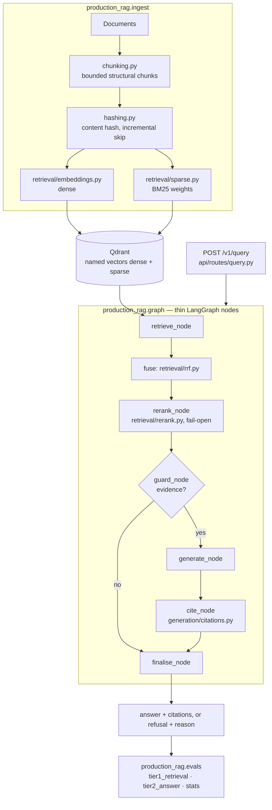

# Case study — production-rag

How a retrieval-augmented question-answering service was built so that a stranger can clone
it, run the whole path for free, and check every claim it makes about itself.

The free-path flagship through the v1.0 season remains **clone-only**: no Vercel host, no
`production-rag.vercel.app` (that hostname is Ipsura and is never this product). Releases
span [v0.1.0](https://github.com/pabloalvarez99/production-rag/releases/tag/v0.1.0) through
**v1.0.0**. This case study is kept current with season trade-offs, not frozen at the first
tag.

## The constraints that shaped it

Four constraints were fixed before any code, and every trade-off below follows from them.

1. **A cloneable $0 path.** Ingest, retrieval, answering, the web UI and both evaluation
   tiers must run with no account, no credential, and no billed call. A reviewer who needs a
   key to see the system is a reviewer who never sees it.
2. **No keys and no provider network in the default tests.** CI sets `OPENAI_API_KEY`,
   `COHERE_API_KEY` and `QDRANT_API_KEY` to the empty string. If the code ever starts quietly
   requiring a credential, the build goes red instead of a cloner discovering it.
3. **Evidence or refusal.** An answer either carries citation markers that resolve to the
   passages the model was given, or the system declines and says why. Fluent unsupported prose
   is the failure this project exists to prevent.
4. **Production-shaped boundaries, honestly labelled.** Where hardening is absent — auth,
   rate limits, a metrics route — it is named as absent rather than implied by a diagram.

The consequence of the third and fourth together runs through the whole repository: because
the free path uses deterministic local providers, the system can prove its *contracts* for
free but cannot prove its *quality* for free.

## Architecture



`query_pipeline.py` is the single public entry point; everything under `graph/` and
`generation/` is an implementation detail of it. The HTTP response is a deliberately narrow
projection — answer, citations, `refused`, `refusal_reason` — while timings, counts and the
collection name stay on the library result and in the logs, keyed by request id.

## The trade-offs worth an interview

**Dense and sparse, fused by rank rather than score.** Dense retrieval fails predictably on
rare literal tokens — part numbers, error codes, function names — and sparse BM25 fails just
as predictably on paraphrase. Running both costs one extra Qdrant query. Fusing them is the
subtle part: cosine similarity is bounded, BM25 is unbounded and corpus-dependent, so any
weighted blend needs a normalisation that has to be re-fitted as the corpus grows. Reciprocal
rank fusion (`retrieval/rrf.py`) sums `1/(k + rank)` with `k = 60`, so there is no scale to
calibrate and nothing to drift. The price is that RRF discards magnitude entirely, which is
exactly what the reranker is for. [ADR-0001](adr/0001-hybrid-qdrant.md).

**Fail-open reranking, hard-fail capability loss.** A cross-encoder scores each
`(query, passage)` pair with attention across both texts, which is why it is a reranking stage
over a short list rather than a retriever: it cannot be precomputed. It is fed more candidates
than it keeps so it can lift a passage fusion buried deep in the list. If the provider errors,
times out, or returns something malformed, `retrieval/rerank.py` returns fusion order and the
query succeeds — the result is correct in kind, merely ordered worse. Every response carries a
`rerank` object with `applied`, `candidates` and `error`, so the degradation is reported rather
than silent. The opposite posture applies to a *missing capability*: a collection with no
`sparse` named vector aborts with the instruction to recreate it, because a hybrid system that
quietly stops being hybrid is the bug nobody finds. [ADR-0004](adr/0004-rerank-cross-encoder.md).

**Citations resolve against the prompt, not against retrieval.** A marker `[3]` is an ordinal
into the context *this request assembled* — the third numbered block in the rendered prompt.
Resolution is therefore a lookup, not a similarity match between a generated sentence and a
passage, which would attribute fluency rather than provenance. It matters that the lookup runs
against the prompt blocks: the context budget can truncate the retrieval list, and mapping
against the longer list would shift every marker silently, in the direction that makes
citations look fine. Out-of-range markers are stripped from the answer and recorded in
`invalid_markers`, because a footnote that goes nowhere reads as *more* grounded than an
uncited sentence. Surviving markers are never renumbered, so an answer always matches the
prompt that produced it. [ADR-0005](adr/0005-grounded-generation.md).

**Refusal is decided by the graph, not by the model.** When nothing clears the evidence bar,
`guard_node` takes the refusal edge and the generate node is never entered — no provider call
is made at all. Asking the model to abstain would delegate the judgement to the component whose
documented failure mode is precisely that judgement. A refusal is a `200` with `refused: true`
and a reason from a closed set (`no_evidence`, `model_abstained`, `no_citations`,
`empty_answer`), so an operator can alert on one and an eval can group by them. The stated cost:
answer recall is capped by retrieval recall, so a spike in refusals is a retrieval
investigation.

**Fake-first providers are plumbing evidence, never a quality claim.** The `fake` embedder,
LLM, reranker and judge share the interfaces of the hosted ones, are deterministic, and touch
no network. Under them the whole contract is exercised: fusion arithmetic, the fail-open
branch, budgeting, marker resolution, invalid-marker stripping, both refusal checks, the
response schema, the report contracts. The sparse branch is genuinely lexical, since BM25
weights are computed from the corpus text in pure Python. What is *not* real is the dense
branch — a hash embedder makes a paraphrase match luck — and the judged columns. Hence: the
contract is live everywhere; answer and retrieval quality are live only on hosted providers.

**Thin graph nodes, optional observability.** The LangGraph nodes in `graph/nodes.py` are
adapters around one stage each with no business logic, which is what makes stage latency and
node latency the same number by construction. Timings are collected on every request; whether
they are *visible* depends on the surface, because `debug` is caller-controlled and may only
widen the response to things that would be safe to publish. Tracing (`observability/`) is a
seam: the null tracer is the default, Langfuse is opt-in, an optional OTel console exporter
sits behind `PRAG_OTEL_CONSOLE` (off in CI), and a trace failure never fails a request.
[ADR-0002](adr/0002-langgraph-query.md), [ADR-0006](adr/0006-observability.md).

**Stream is extra, not a replacement for `POST /v1/query`.** Reviewers wait on a blank
panel and ask for tokens. The wrong answer is to replace the JSON contract with a stream,
or to treat every provisional token as "the answer". Citation validation and refusal run
*after* generation against the full text ([ADR-0005](adr/0005-grounded-generation.md));
text that has not passed that gate is provisional. So `POST /v1/query` stays the contract,
and `POST /v1/query/stream` is additive SSE: `meta` → provisional `delta`s → one terminal
`result` that carries the same body the JSON route would have returned (grounded **or**
refused). A provider outage is an `error` event with `refused: false`, never a soft
refusal. One pipeline is teed (`StreamingTee`); the stream route does not re-implement
retrieval or guardrails. The UI draft is labelled **Draft · not verified** and is
replaced wholesale when `result` arrives. [ADR-0012](adr/0012-streamed-answers.md).

**Allowlist filters fail closed — and the sample corpus needs `title=Filtering`.**
`retrieval.filters.allowed_fields` is not decoration: a field outside the list is rejected
with 422 / `filter_not_allowed` before any embed or search runs, never dropped while the
query continues under different evidence. That is the same posture as rejecting an unknown
JSON body field. The free demo's visible filter beat uses **`title=Filtering`**, not
`source=sample`, for a payload reason that is easy to get wrong: on the sample / demo
corpus path, filtering by `source=sample` does not narrow the way a reviewer expects
because the points that power the demo are not labelled so that `source=sample` selects a
strict subset of the filtering document. The committed capture and the UI chip therefore
use the title that actually isolates `qdrant/search/filtering.md`.

**Cache keys include filters *and* corpus identity.** The in-process result cache is
**off by default** (`CACHE_ENABLED` / config for local demos only). When on, the key is
`(collection, query, filters, embedder id, llm id, retrieval fingerprint, corpus identity)`.
Filters are not optional decoration: an unfiltered answer must never serve a filtered
query (or the reverse). Corpus hash and chunker version are not optional either: two
corpora that share a collection name must not cross-hit. A second identical replay
records `cache: hit` under debug; a filter or identity mismatch is a miss even when the
question text matches. [ADR-0011](adr/0011-metadata-filters.md),
[ADR-0013](adr/0013-filter-aware-query-cache.md),
[ADR-0014](adr/0014-corpus-hash-in-cache-key.md).

**Refuse versus error is a product boundary.** Refusal means the corpus evidence is
insufficient and the system chose not to invent. Provider failure, embedder failure, and
Qdrant down mean a dependency failed: HTTP 503 with `error_type` in
`{provider_error, store_unavailable, …}` and **`refused: false`**. Soft-failing a down
dependency as a refusal would teach clients to stop retrying the one path that would
succeed after recovery. Capture scripts force `CACHE_ENABLED=false` so a failure still is
not a cache hit of a previous grounded answer.

**Why Qdrant stays local (and why there is no P1 host).** The free path is the hiring
surface: clone, `demo_setup`, empty keys, CI with empty keys. Hosted Qdrant Cloud would
add a secret, a bill, and a multi-tenant story this repository does not operate. The
portfolio gateway (P5) may front services later; P1 itself does not invent a public URL.
Never cite `production-rag.vercel.app` — that is Ipsura, not this product.

**Evaluation program, not a screenshot.** The free-path program set
(`data/eval/golden-free-path.jsonl`, n≥50) carries slices `answerable`, `unanswerable`,
`filter`, and `hybrid-vs-dense`. Difficulty predicates fail CI when a ranking-stress
slice is all target rank-1. The published scorecard ablation
(dense / sparse / hybrid / hybrid+rerank) is labeled **plumbing** under fake providers
with `billed=false`. Reportable comparisons still require `n ≥ 30` and a CI that excludes
zero ([ADR-0010](adr/0010-statistical-reporting.md)). Load numbers in
`docs/assets/load.json` are honest single-process timings, not SOTA throughput.

## How it is measured, and what that does not prove

Tier 1 (`evals/tier1_retrieval.py`) measures retrieval: source-level hit, recall, MRR and
binary-gain nDCG over the golden set's `expected_source_paths`. It is free and runs on every
change. Tier 2 (`evals/tier2_answer.py`) measures the answer contract over the real
`run_query` path: citation precision, invalid-marker rate and refusal accuracy are judge-free;
faithfulness and relevance need a judge and are indicative only. Every metric is source-level,
not chunk-level, and is named `source_*` where that matters — reporting a document-level number
as `recall@k` would overstate it. [ADR-0003](adr/0003-eval-strategy.md).

Comparisons are paired and reported mechanically (`evals/stats.py`,
[ADR-0010](adr/0010-statistical-reporting.md)): a seeded bootstrap interval and an exact
McNemar test decide whether a delta becomes a claim or is printed as *directional only* with
its sample size and interval. The scorecard region in the README is generated from
`data/eval/reports/scorecard.json` by `tools/render_docs.py`, and CI fails when the two
disagree, so a published number cannot drift from its artefact.

The published scorecard is a deterministic contract fixture: its provenance line records
`embedder=fake`, `LLM=fake`, `judge=none`, a 60-item golden set, date `2026-08-11`, commit
`04102b0d`, and `billed: false`. It demonstrates that a measurement artefact reaches public
documentation without copy-and-paste. It says nothing about hosted answer quality, and the one
comparison it carries is explicitly not reportable. Replacing it needs a billed run with named
providers; that run has not happened.

## Failure behaviour, by name

| Situation | What happens |
| --- | --- |
| Retrieval returns nothing, or everything is filtered out | refusal, `no_evidence`, no LLM call |
| Model emits the abstention sentinel anywhere in its text | refusal, `model_abstained` |
| Nothing in the answer resolves to a block, `require_citation: true` | refusal, `no_citations` |
| Out-of-range `[n]` markers | stripped from the text, recorded in `invalid_markers`, answer served |
| Reranker error, timeout or malformed response | fusion order returned, degradation reported |
| Collection has no `sparse` named vector | abort with the recreate instruction — never a silent dense-only fallback |
| Reranker extra not installed, or hosted provider without its key | abort before any query runs |
| Qdrant unreachable | `POST /v1/query` → 503 `store_unavailable`, `refused: false`; UI degraded path; `/health` stays 200 |
| Generation / embedder provider fails | 503 `provider_error`, `refused: false` — never a soft refusal |
| Wrong collection name on the request | 404 `wrong_collection`, `refused: false` |
| Collection vector/embedder identity mismatch | 409 `collection_mismatch` (typed; not a fluent wrong answer) |

## How to reproduce

```powershell
.\scripts\demo_setup.ps1          # macOS or Linux: ./scripts/demo_setup.sh
```

Then ask *Why does hybrid search use reciprocal rank fusion?* for a grounded answer, and *Who
won the Antarctic underwater chess championship?* for the refusal path. Without the UI:

```bash
docker compose up -d --build
docker compose run --rm api python -m production_rag.ingest --source data/raw --embedder fake --recreate-collection
docker compose run --rm api python -m production_rag.evals.run --tier all --embedder fake --llm fake
python tools/render_docs.py --check
```

Full commands, including the scorecard sweep, are in
[Try it free](../README.md#try-it-free-0-no-api-key); the checks a change is reviewed against
are in [CONTRIBUTING.md](../CONTRIBUTING.md).

## Current limits and the next boundary

- **No hosted-provider baseline.** No number here measures semantic retrieval or answer
  quality, and none is presented as if it did.
- **No authentication, authorization or rate limiting.** Anyone who can reach the port can
  query the service; it does not belong on an untrusted network. That work is assigned to the
  platform project in the series, not quietly implied here.
- **No metrics route**, no production retry or circuit-breaker policy, no multi-tenancy, and
  no load or concurrency testing — so no throughput or latency figure is claimed.
- **Metrics are source-level**, the judge is uncalibrated against human labels, and no merge
  gate is armed: the mechanism (`--fail-under-hit`) exists, the defensible number does not.

The next boundary is a single billed run with named providers on the same scorecard contract,
which replaces the fixture artefact and turns the reporting machinery — already built, already
failing closed — into an actual quality baseline. Everything else on the list is deliberately
downstream of that.
