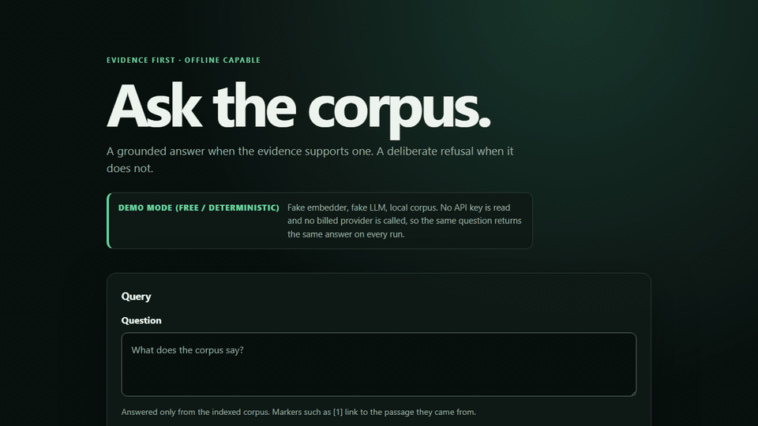

# Record the demo



*Fake embedder, fake LLM, local corpus — a plumbing demonstration, not a quality
evaluation.*

`docs/assets/production-rag-demo.gif` is generated, not filmed:

```powershell
pip install -e ".[docs]"
playwright install chromium
python scripts/record_demo.py
```

`scripts/record_demo.py` reuses the pipeline in `scripts/capture_ui.py` — the same
dedicated collection, the same fake providers, the same stabilised request id and
timing labels — then drives the real UI at a fixed viewport, saves one PNG per
beat, and assembles them with ffmpeg into a palette-optimised loop. It needs
`ffmpeg` on `PATH`. Because it is a sequence of real renderings rather than a
screen recording, there is no cursor, no window chrome, and no desktop behind it,
and it prints the output's size and SHA-256 digest so a rerun is comparable.

The six beats are the storyboard at the top of that script: the empty form, the
grounded question being entered, the grounded answer with its citations, the
expanded pipeline timings, the refusal question being entered, and the refusal
with its reason. Changing the beats means editing `STORYBOARD`, not re-shooting
by hand.

If a future change makes the GIF exceed the size budget enforced by
`tests/test_docs_assets.py`, keep the two PNG posters and commit a short webm or
mp4 instead: `--width` lowers the resolution, and the same frame directory feeds
any encoder ffmpeg supports. Do not solve a size problem by dropping the refusal
beat — the refusal is the half of the recording that makes the other half mean
something.

## The social preview card

`docs/assets/social-preview.png` is the image GitHub shows when the repository is
linked in a message, a post, or a chat — for many readers it is the first thing
they see of this project, before the README.

```powershell
python scripts/make_social_preview.py
```

`scripts/make_social_preview.py` lays the card out in HTML and screenshots it
with Playwright, rather than drawing it with an image library or generating it
with a model. The wordmark is real text, so it is exactly right rather than
approximately right; the palette is parsed out of `src/production_rag/static/app.css`,
so the card cannot drift away from the UI it advertises; and the evidence panel
is the committed `ui-grounded.png` itself, not a re-staged imitation of it.

It is built at 1280x640 because that is the size GitHub renders and crops to. A
16:9 card loses a band off the top and bottom. `tests/test_docs_assets.py`
asserts the committed dimensions.

### Setting it on the repository

**This is a manual step, and no script here performs it.** The social preview is
not part of the repository contents: it lives in repository settings, and the
API token used for automation cannot upload it.

1. Open <https://github.com/pabloalvarez99/production-rag/settings> (Settings →
   General).
2. Scroll to **Social preview** and choose **Edit → Upload an image**.
3. Upload `docs/assets/social-preview.png`.
4. Verify by pasting the repository URL into any chat client that unfurls links,
   or through <https://www.opengraph.xyz/>. GitHub caches the old card for a
   while; a stale unfurl right after upload is expected, not a failure.

Until someone does that by hand, the committed file is the intended card and not
the live one.

## Record it live instead

The section below is for a live walkthrough, where the point is watching a person
drive the system rather than reading a loop.

## Prepare

From the repository root, run exactly one setup command:

```powershell
.\scripts\demo_setup.ps1
```

On macOS or Linux, run `./scripts/demo_setup.sh`. Both scripts start Qdrant,
rebuild only the `prag_demo` collection from `data/corpus` with the deterministic
fake embedder, and start the web server. They make no billed provider call.

## Record in this order

1. Open <http://localhost:8000/> and keep the browser wide enough to show the
   answer and its evidence together.
2. Ask **“Why does hybrid search use reciprocal rank fusion?”** Show the grounded
   answer, citation links, source passages, and pipeline timings.
3. Set the **metadata filter** to `tags` = `hybrid` and ask the first question again. Show
   that every citation now comes from `01-hybrid-search.md`, and that the footer names the
   narrowing.
4. Clear the filter and ask **“Who won the Antarctic underwater chess championship?”** Show
   the explicit refusal and its reason.
5. Stop recording after the refusal. The refusal reads as a deliberate product
   choice only after the grounded path has established that the system will
   answer confidently when it has evidence.

This is a plumbing demonstration, not a quality evaluation: the embedder, LLM,
and reranker are deterministic fakes. Stop the stack afterward with
`docker compose down`; the named Qdrant volume is retained.

## What the page shows

The header carries a **Demo mode (free / deterministic)** label, and every result
repeats it in its diagnostics footer. The label is literal: the UI route pins the
request to the fake embedder and the fake LLM, so no API key is read and no billed
provider is called. A grounded result separates the **Answer** from the
**Citations** that support it, each marker linking to the passage it came from; a
refusal states its reason instead of guessing; a dependency failure says so without
leaking the underlying error. Per-node durations sit behind the collapsed
**Pipeline timings** control.

An optional **metadata filter** narrows the question to documents whose payload matches
one allowlisted field. The fields offered are read from `retrieval.filters.allowed_fields`
for the running deployment, so the control cannot offer something the API would reject; a
field posted by hand anyway renders the same typed 422 the API answers with.
`docs/assets/ui-filtered.png` is the sample corpus answered under `tags` = `hybrid`, with
every citation from `01-hybrid-search.md` and the narrowing named in the result footer.

## Refresh the still captures

`docs/assets/ui-grounded.png`, `ui-filtered.png`, `ui-refusal.png` and
`ui-service-failure.png` come
from `python scripts/capture_ui.py`, after `pip install -e ".[docs]"` and
`playwright install chromium`. That script drives the same credential-free stack
these setup scripts start — fake providers, local corpus, no key — so refreshing the
images costs only the time it takes to run. Rebuild the API image first
(`docker compose build api`): the Dockerfile copies `src/` in, so a capture against a
stale image silently documents the previous UI and prints unchanged digests.
